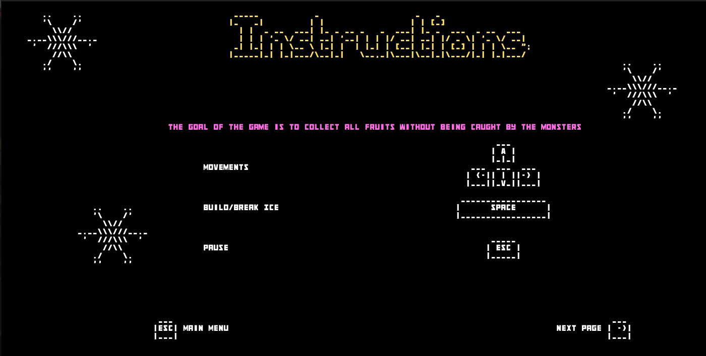
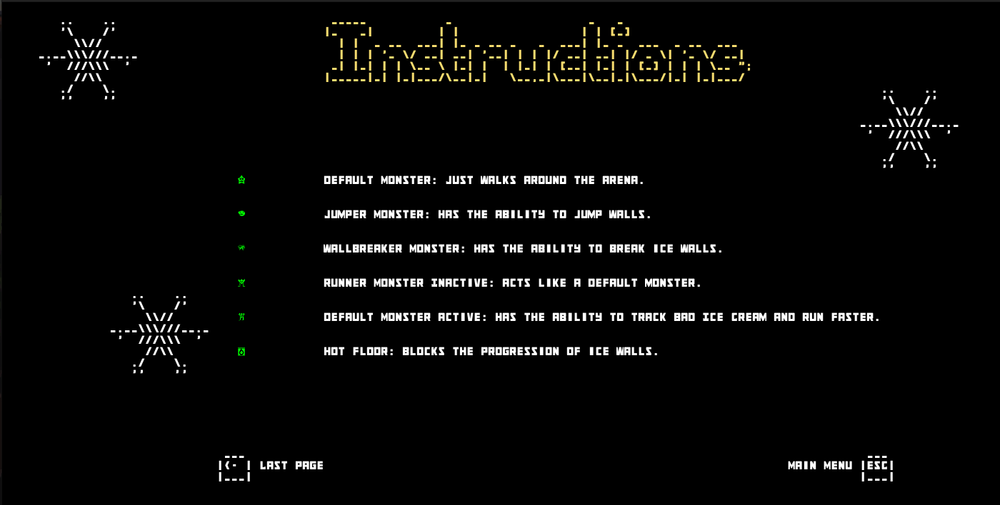
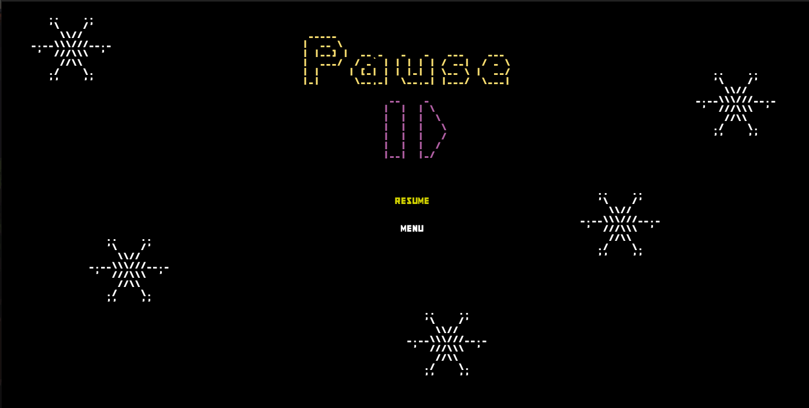

# LDTS-project-l10gr08

## Bem vindo ao Bad Ice Cream!
**Neste jogo _singleplayer_ irás controlar o Bad Ice Cream, fugir de monstros e comer muita fruta! Diverte-te!**

## Niveis:
## Nível 5:

## Ao longo do jogo vais encontrar os seguintes menus:
### Menu Principal:

### Instruções:

### Seleção de Nível:

### Menu de Pausa:

### Menu de Fim de Nível:

### Menu de Fim de Jogo Derrota:

## Relatório Completo:
https://github.com/FEUP-LDTS-2023/project-l10gr08/blob/main/docs/README.md

Este projeto foi realizado por Nelson Neto(up202108117@fe.up.pt), Paulo Fidalgo(up201806603@fe.up.pt) e Simão Neri(up202206370@fe.up.pt).
