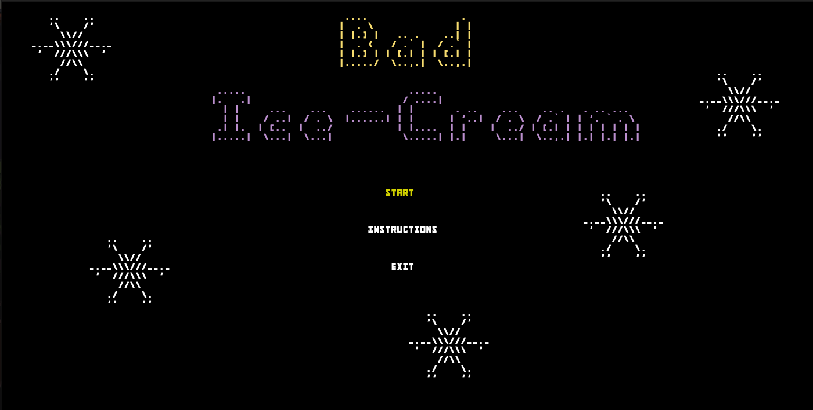
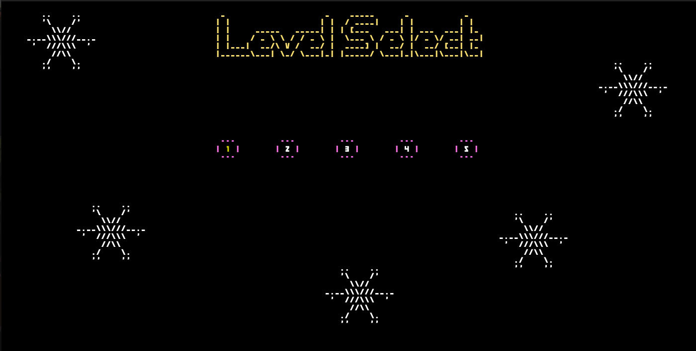

# LDTS-project-l10gr08

## Bem vindo ao Bad Ice Cream!
**Neste jogo _singleplayer_ irás controlar o Bad Ice Cream, fugir de monstros e comer muita fruta! Diverte-te!**

## Menu Principal:

## Instruções:

## Seleção de Nível:

## Menu de Pausa:

## Menu de Fim de Nível:

## Menu de Fim de Jogo:

Este projeto foi realizado por Nelson Neto(up202108117@fe.up.pt), Paulo Fidalgo(up201806603@fe.up.pt) e Simão Neri(up202206370@fe.up.pt).
