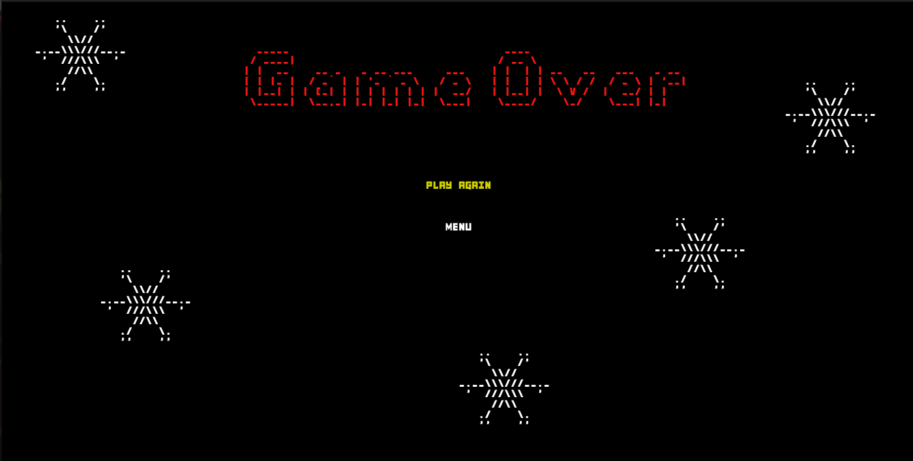
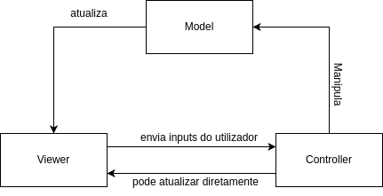
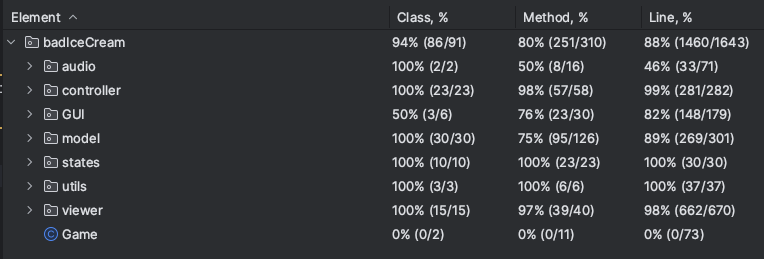

# LDTS 1008 - Bad Ice Cream

Neste jogo de _arcade_ poderás ajudar o Bad Ice Cream a roubar as suas frutas favoritas. Mas, cuidado, a fruta tem dono e os monstros que a protegem não gostam nada de ladrões. Utiliza o poder de criar e destruir paredes de gelo do Bad Ice Cream, para encurralar os monstros e encher a barriga à vontade.

# _Features_ Implementadas
- Movimento do Bad Ice Cream: O personagem irá mover-se para cima (seta para cima), para baixo (seta para baixo), para esquerda (seta para a esquerda) ou para a direita (seta para a direita), de acordo com o input do utilizador;

- Movimento do DefaultMonster: O DefaultMonster irá mover-se aleatoriamente pelos espaços livres no mapa. É o monstro mais lento, aproveita!;

- Colisão do Bad Ice Cream: O personagem morre quando colide com monstros e não consegue avançar caso colida com uma parede;

- Colisão dos Monstros: Os monstros não conseguem avançar caso colidam com outro monstro ou com uma parede;

# _Features_ Planeadas
## _In-Game Features_ 
- Habilidade do Personagem: Quando a tecla de espaço for pressionada, o personagem irá construir uma parede de gelo até ao primeiro bloqueio que lhe aparecer (monstro, fruta, parede ou hot floor). No caso de já existir uma parede de gelo à sua frente, o personagem irá destruí-la em cascata (a destruição é interrompida quando encontrar um espaço vazio ou Stone Wall);

- Movimento do RunnerMonster: O RunnerMonster inicialmente irá ter o comportamento de um Defaultmonster, mas em intervalos curtos de tempo, a sua velocidade será aumentada e este passará a conseguir localizar o personagem (cálculo da trajetória mais curta), por isso foge enquanto podes!;

- Movimento do JumperMonster: O JumperMonster será capaz de saltar para cima de paredes e andar em cima das mesmas de modo a conseguir percorrer sempre o caminho mais curto até ao personagem principal;

- Movimento do WallBreakerMonster: O WallBreakerMonster terá a habilidade de destruir paredes de gelo do mesmo modo que o personagem principal;

- PowerUp do Morango: O Morango é uma fruta rara que dará ao personagem um escudo (o Bad Ice Cream fica azul), que o deixará imune ao toque de um monstro;

- _Hot Floor_: No mapa irão existir zonas onde o IceCream não conseguirá criar paredes de gelo, apesar de ser possível caminhar por cima destas, normalmente;

- Colisão Personagem - Fruta: Quando o personagem avança para uma zona onde já existe uma fruta, coleta a fruta e dependendo do tipo de fruta, poderá receber um _Power Up_;

- Sons no Jogo: Os diferentes Menus e o próprio jogo terão música de fundo. Também as diferentes interações do utilizador com o jogo, terão sons correspondentes. 

## Menus
- Menu Principal: Quando o jogo é iniciado, o "Main Menu" é aberto. Neste, o jogador poderá escolher entre começar a jogar, aceder às instruções ou sair do jogo;

- Instruções: Ao escolher a opção "Instructions" no "Main Menu", o jogador tem acesso a uma página com uma descrição do jogo e os controlos para jogar;

- Seleção de Nível: Ao escolher a opção "Start Game" no "Main Menu", outro menu é aberto, onde será possível escolher entre os diferentes níveis existentes. Com exceção ao nível 1, só é possível escolher um nível se o anterior tiver sido completado com sucesso;

- Menu de Pausa: No decorrer do jogo, o jogador pode clicar na tecla _Escape_, abrindo um menu que pausa o jogo. Neste, poderá escolher entre continuar a jogar ou sair para o "Main Menu".

- Menu de Fim de Nível: Após um nível ser terminado, um novo menu irá abrir, onde o utilizador poderá escolher entre continuar para o próximo nível, ou retornar ao menu principal;

- Menu de Fim de Jogo: Ao ser morto por um dos monstros, será aberto um menu onde o utilizador poderá escolher entre jogar novamente, ou voltar ao menu principal.

# Design 
## Padrão Arquitetural
### Contexto do Problema

Desde o início do projeto, visou-se desenvolver uma estrutura que fosse bem organizada, de modo ao código ser fácil de ler e de se tornar trivial a localização de snippets de código nos diversos ficheiros, permitindo ainda, que diversas pessoas consigam alterar o código, sem prejudicarem o trabalho dos outros.

### Padrão
Com estes problemas em mente, optou-se por aplicar o padrão arquitetural MVC (Model View Controller), que divide o programa em três camadas, _View_, _Model_ e _Controller_. A camada _Model_ contém apenas os dados, que caso sofram mudanças, informará a _View_ . Por sua vez a _View_ é responsável pela interface com a qual o jogado vai interagir, tendo em conta os dados atuais e envia ações do utilizador para o _Controller_. Esta última camada interpreta os inputs recebidos pelo utilizador e fornecidos pelo _View_ e atualiza o _Model_ com base nessa informação. 

### Implementação
A implantação deste padrão pode ser representada através do seguinte modelo U.M.L:

As 3 classes podem ser encontradas nos seguintes links:
- Controller-(https://github.com/FEUP-LDTS-2023/project-l10gr08/tree/main/src/main/java/badIceCream/controller)
- Model-(https://github.com/FEUP-LDTS-2023/project-l10gr08/tree/main/src/main/java/badIceCream/model)
- View-(https://github.com/FEUP-LDTS-2023/project-l10gr08/tree/main/src/main/java/badIceCream/viewer)

### Consequências
A escolha deste padrão trouxe vantagens e desvantagens:

Vantagens
- Melhorar a manutenção do código, uma vez que é fácil de localizar os erros e em caso de adições apenas é necessário criar um novo elemento viewer, controller ou model;
- Simplicidade na criação de testes;
- Código fácil de ler;
- Divisão em partes "independentes", permite a várias pessoas desenvolver o código em simultâneo, sem conflitos.

Desvantagens
- É necessário um melhor planeamento prévio e mais atenção na escrita do código, uma vez que as componentes estão separadas.

## _State Pattern_
### Contexto do Problema
Ao longo do jogo, é possível que um objeto se encontre em diferentes estados, o que pode afetar o comportamento de todo o programa. Haveria então uma grande dependência em if ’s e switch cases’s, o que tornaria a interpretação do código mais complexa, uma vez que todos os comportamentos seriam executados por apenas uma classe, bem como dificultaria a extensão do código.

### Padrão
O _State Pattern_ permite resolver este problema facilmente, pegando no código que posteriormente estaria numa só classe e dividindo-o em várias classes, fazendo com que o objeto consiga mudar de comportamento quando o seu estado muda. Esta abordagem faz sentido quando um objeto atua de forma diferente consoante o seu estado interno. (Como por exemplo nos estados dos diversos Menus utilizados)
### Implementação

A implantação deste  padrão é representada através do seguinte modelo U.M.L:

# 

# 

O código para as classes que estendem State ainda não está completo, mas a sua base encontra-se nos seguintes links:
- GameState-(https://github.com/FEUP-LDTS-2023/project-l10gr08/blob/main/src/main/java/badIceCream/states/GameState.java);
- MainMenuState-(https://github.com/FEUP-LDTS-2023/project-l10gr08/blob/main/src/main/java/badIceCream/states/MainMenuState.java);
- PauseMenuState-(https://github.com/FEUP-LDTS-2023/project-l10gr08/blob/main/src/main/java/badIceCream/states/PauseMenuState.java).

### Consequências
A escolha deste padrão trouxe várias vantagens:

Vantagens
- Remove a dependência em if’s e switch case’s;
- Torna o código mais fácil de ler;
- Torna a correção do código e a criação de testes mais simples;
- Ao introduzir novos estados deixa de ser necessário mudar estados já existentes.

## _*** Pattern_
### Contexto do Problema

### Padrão

### Implementação

### Consequências
   
## _Code Smells_
**TO BE DONE**  

## Testes
### _Coverage Report_

### _Mutation Testing Report_
**TO BE DONE**

## Self-evaluation
**To BE DONE**
