# LDTS 1008 - Bad Ice Cream

Neste jogo de _arcade_ poderás ajudar o Bad Ice Cream a roubar as suas frutas favoritas. Mas, cuidado, a fruta tem dono e os monstros que a protegem não gostam nada de ladrões. Utiliza o poder de criar e destruir paredes de gelo do Bad Ice Cream, para encurralar os monstros e encher a barriga à vontade.

# _UML Diagram_
O esquema e desenho de alto nível deste jogo foram pensados inicialmente e recorreu-se a Unified Modelling Language (UML) para o representar. O UML é o seguinte:

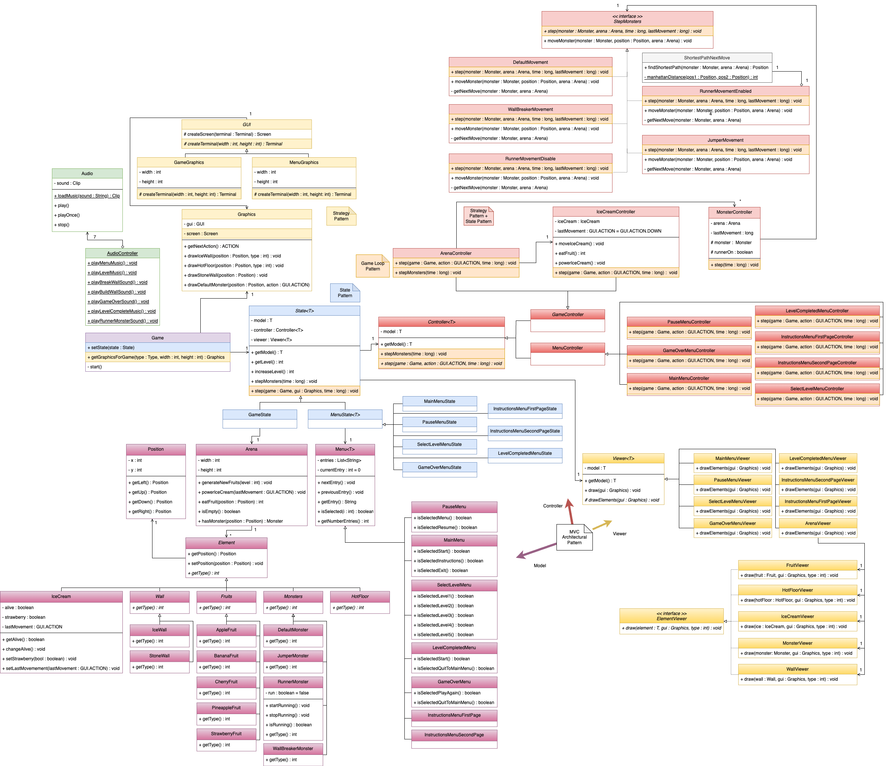

# _Features_ Implementadas
## _In-Game Features_
- Movimento do Bad Ice Cream: O personagem irá mover-se para cima (seta para cima), para baixo (seta para baixo), para esquerda (seta para a esquerda) ou para a direita (seta para a direita), de acordo com o input do utilizador;

- Movimento do DefaultMonster: O DefaultMonster irá mover-se aleatoriamente pelos espaços livres no mapa. É o monstro mais lento, aproveita!;

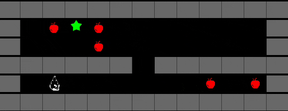

- Colisão do Bad Ice Cream: O personagem morre quando colide com monstros e não consegue avançar caso colida com uma parede;

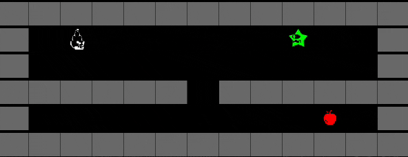

- Colisão dos Monstros: Os monstros não conseguem avançar caso colidam com outro monstro ou com uma parede;

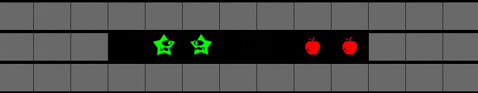

- Colisão Personagem - Fruta: Quando o personagem avança para uma zona onde já existe uma fruta, coleta a fruta e dependendo do tipo de fruta, poderá receber um _Power Up_;

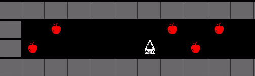

- Habilidade do Personagem: Quando a tecla de espaço for pressionada, o personagem irá construir uma parede de gelo até ao primeiro bloqueio que lhe aparecer (monstro, parede ou hot floor). No caso de já existir uma parede de gelo à sua frente, o personagem irá destruí-la(a destruição é interrompida quando encontrar um espaço vazio ou Stone Wall). As frutas no caminho da parede de gelo serao também congeladas;

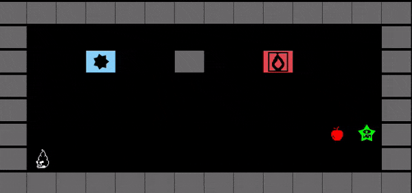

- Movimento do RunnerMonster: O RunnerMonster inicialmente irá ter o comportamento de um Defaultmonster, mas em intervalos curtos de tempo, a sua velocidade será aumentada e este passará a conseguir localizar o personagem (cálculo da trajetória mais curta), por isso foge enquanto podes!;

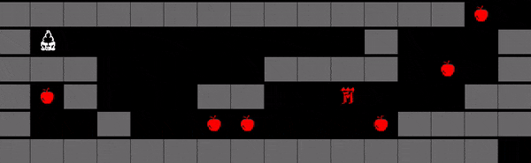

- Movimento do JumperMonster: O JumperMonster será capaz de saltar para cima de paredes e andar em cima das mesmas;

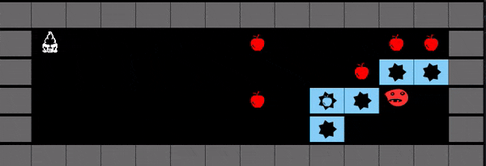

- Movimento do WallBreakerMonster: O WallBreakerMonster terá a habilidade de destruir paredes de gelo do mesmo modo que o personagem principal;

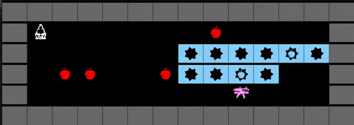

- PowerUp do Morango: O Morango é uma fruta rara que dará ao personagem um escudo (o Bad Ice Cream fica azul), que o deixará imune ao toque de um monstro por um certo período de tempo;

- _Hot Floor_: No mapa irão existir zonas onde o IceCream não conseguirá criar paredes de gelo, apesar de ser possível caminhar por cima destas normalmente;

- Sons no Jogo: Os diferentes Menus e o próprio jogo terão música de fundo. Também as diferentes interações do utilizador com o jogo, terão sons correspondentes.

## Menus

- Menu Principal: Quando o jogo é iniciado, o "Main Menu" é aberto. Neste, o jogador poderá escolher entre começar a jogar, aceder às instruções ou sair do jogo;

- Primeira Página das Instruções: Ao escolher a opção "Instructions" no "Main Menu", o jogador tem acesso a uma página com uma descrição do jogo e os controlos para jogar, juntamente com as opçoes de avançar para a página seguinte das instruçoes ou regressar ao menu principal;

- Segunda Página das Instruçoes : Ao clicar na seta da direita na primeira página das intruçoes, o jogador tem acesso a uma nova página de instruçoes, onde é apresentada informaçao sobre os monstros e hot floors, juntamente com as opçoes de voltar à página anterior das instruçoes ou ao menu principal;
 

- Seleção de Nível: Ao escolher a opção "Start Game" no "Main Menu", outro menu é aberto, onde será possível escolher entre os diferentes níveis existentes. Com exceção ao nível 1, só é possível escolher um nível se o anterior tiver sido completado com sucesso;

- Menu de Pausa: No decorrer do jogo, o jogador pode clicar na tecla _Escape_, abrindo um menu que pausa o jogo. Neste, poderá escolher entre continuar a jogar ou sair para o "Main Menu".

- Menu de Fim de Nível: Após um nível ser terminado, um novo menu irá abrir, onde o utilizador poderá escolher entre continuar para o próximo nível, ou retornar ao menu principal;

- Menu de Fim de Jogo: Ao ser morto por um dos monstros, será aberto um menu onde o utilizador poderá escolher entre jogar novamente, ou voltar ao menu principal.

# _Features_ Planeadas
Todas as _features_ planeadas inicialmente foram implementadas. 

#
## Gameplay
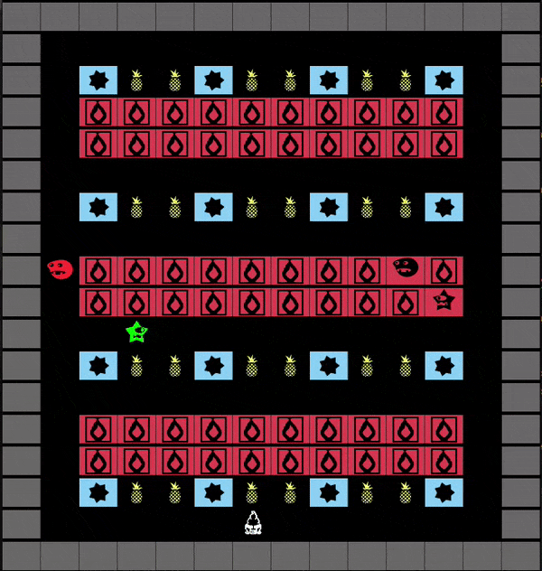

#
# Design 
## Padrão Arquitetural
### Contexto do Problema

Desde o início do projeto, visou-se desenvolver uma estrutura que fosse bem organizada, de modo ao código ser fácil de ler e de se tornar trivial a localização de snippets de código nos diversos ficheiros, permitindo ainda, que diversas pessoas consigam alterar o código, sem prejudicarem o trabalho dos outros.

### Padrão
Com estes problemas em mente, optou-se por aplicar o padrão arquitetural MVC (Model View Controller), que divide o programa em três camadas, _View_, _Model_ e _Controller_. A camada _Model_ contém apenas os dados, que caso sofram mudanças, informará a _View_ . Por sua vez a _View_ é responsável pela interface com a qual o jogado vai interagir, tendo em conta os dados atuais e envia ações do utilizador para o _Controller_. Esta última camada interpreta os inputs recebidos pelo utilizador e fornecidos pelo _View_ e atualiza o _Model_ com base nessa informação. 

### Implementação
A implantação deste padrão pode ser representada através do seguinte modelo U.M.L:

As 3 classes podem ser encontradas nos seguintes links:
- Controller: https://github.com/FEUP-LDTS-2023/project-l10gr08/tree/main/src/main/java/badIceCream/controller
- Model: https://github.com/FEUP-LDTS-2023/project-l10gr08/tree/main/src/main/java/badIceCream/model
- View: https://github.com/FEUP-LDTS-2023/project-l10gr08/tree/main/src/main/java/badIceCream/viewer

### Consequências
A escolha deste padrão trouxe vantagens e desvantagens:

Vantagens
- Melhorar a manutenção do código, uma vez que é fácil de localizar os erros e em caso de adições apenas é necessário criar um novo elemento viewer, controller ou model;
- Simplicidade na criação de testes;
- Código fácil de ler;
- Divisão em partes "independentes", permite a várias pessoas desenvolver o código em simultâneo, sem conflitos.

Desvantagens
- É necessário um melhor planeamento prévio e mais atenção na escrita do código, uma vez que as componentes estão separadas.

## _State Pattern_
### Contexto do Problema
Ao longo do jogo, é possível que um objeto se encontre em diferentes estados, o que pode afetar o comportamento de todo o programa. Haveria então uma grande dependência em if ’s e switch cases’s, o que tornaria a interpretação do código mais complexa, uma vez que todos os comportamentos seriam executados por apenas uma classe, bem como dificultaria a extensão do código.

### Padrão
O _State Pattern_ permite resolver este problema facilmente, pegando no código que posteriormente estaria numa só classe e dividindo-o em várias classes, fazendo com que o objeto consiga mudar de comportamento quando o seu estado muda. Esta abordagem faz sentido quando um objeto atua de forma diferente consoante o seu estado interno. (Como por exemplo nos estados dos diversos Menus utilizados)
### Implementação
Posto isto, utilizou-se este padrão nas seguintes classes, representadas pelo seguinte modelo UML:

#### Game e Menu States
Os controladores do jogo alteram o estado do programa, consoante o acontecimento de algum evento. (Por exemplo, transição de game state para PauseMenu assim que utilizador pressiona "ESC", entre outros)

# 

O código para as classes que estendem State, encontra-se nos seguintes links:
- GameState: https://github.com/FEUP-LDTS-2023/project-l10gr08/blob/main/src/main/java/badIceCream/states/GameState.java
- MenuState: https://github.com/FEUP-LDTS-2023/project-l10gr08/blob/main/src/main/java/badIceCream/states/MenuState.java

O código para as classes que estendem MenuState, encontram-se nos seguintes links:
- MainMenuState: https://github.com/FEUP-LDTS-2023/project-l10gr08/blob/main/src/main/java/badIceCream/states/MainMenuState.java
- PauseMenuState: https://github.com/FEUP-LDTS-2023/project-l10gr08/blob/main/src/main/java/badIceCream/states/PauseMenuState.java
- SelectLevelMenuState: https://github.com/FEUP-LDTS-2023/project-l10gr08/blob/main/src/main/java/badIceCream/states/SelectLevelMenuState.java
- InstructionsMenuFisrtPageState: https://github.com/FEUP-LDTS-2023/project-l10gr08/blob/main/src/main/java/badIceCream/states/InstructionsMenuFirstPageState.java
- InstructionsMenuSecondPageState: https://github.com/FEUP-LDTS-2023/project-l10gr08/blob/main/src/main/java/badIceCream/states/InstructionsMenuSecondPageState.java
- GameOverMenuState: https://github.com/FEUP-LDTS-2023/project-l10gr08/blob/main/src/main/java/badIceCream/states/GameOverMenuState.java
- LevelCompletedMenuState: https://github.com/FEUP-LDTS-2023/project-l10gr08/blob/main/src/main/java/badIceCream/states/LevelCompletedMenuState.java
#

### Consequências
A escolha deste padrão trouxe várias vantagens:

Vantagens
- Remove a dependência em if’s e switch case’s;
- Torna o código mais fácil de ler;
- Torna a correção do código e a criação de testes mais simples;
- Ao introduzir novos estados deixa de ser necessário mudar estados já existentes.

## _Strategy Pattern e State Pattern_
### Game e Menu Graphics
#### Contexto do Problema
A representação dos vários elementos e suas variantes em fonte, implicou a inclusão de duas fontes no jogo, uma para os Menus e outra para o Jogo. Neste sentido, utilizou-se o strategy pattern para definir em qual os gráficos a serem utilizados. Sempre que o jogo passa de um menu para o jogo em si, cria um novo estado e, altera os gráficos para GameGraphics. De igual modo, se enquanto o jogo, o jogador perder, ganhar ou pressionar o "ESC" para fazer pausa, os gráficos passam de GameGraphics para MenuGraphics.

#### Padrão
Estes padrões foram utilizados pelo Graphics, na medida em que, o jogo inclui dois tipos de gráficos diferentes, a saber: MenuGraphics e GameGraphics. Deste modo, a alteração de um tipo de gráficos para outro é feita através do Strategy Pattern. Os controladores são responsáveis por informar o Game que o estado dos gráficos alterou, quando necessário.
Sendo assim, o Game altera o seu campo privado "Graphics", que é criado com um dos gráficos existentes: GameGraphics ou MenuGraphics, em tempo de execução.

#### Implementação
A implementação destes padrões é representada através do seguinte modelo UML:

O código para as classes envolvidas encontra-se nos seguintes links:
- GUI: https://github.com/FEUP-LDTS-2023/project-l10gr08/blob/main/src/main/java/badIceCream/GUI/GUI.java
- GameGraphics: https://github.com/FEUP-LDTS-2023/project-l10gr08/blob/main/src/main/java/badIceCream/GUI/GameGraphics.java
- MenuGraphics: https://github.com/FEUP-LDTS-2023/project-l10gr08/blob/main/src/main/java/badIceCream/GUI/MenuGraphics.java
- Graphics: https://github.com/FEUP-LDTS-2023/project-l10gr08/blob/main/src/main/java/badIceCream/GUI/Graphics.java
- Game: https://github.com/FEUP-LDTS-2023/project-l10gr08/blob/main/src/main/java/badIceCream/Game.java

### Movimento dos Monstros
#### Contexto do Problema
O movimento dos monstros difere, pelo que se criou uma interface "StepMonsters", com dois métodos. No jogo estão presentes 5 tipos diferentes de movimentos de monstros (Default, WallBreaker, Jumper, RunnerEnabled e RunnerDisabled). O tipo de movimento é definido em tempo de execução, na medida em que a classe MonsterController está encarregue de definir o movimento de cada monstro. Já que o Runner pode ter dois movimentos diferentes (modo perseguição e aletatório), cabe ao controlador alterar o comportamento destes monstros. Este padrão é uma junção com algumas alterações do Strategy Pattern e State Pattern.

#### Padrão
Recorreu-se ao design pattern Strategy, que define algoritmos diferentes para o movimento dos monstros, consoante o tipo de monstro em questão. As entidades que chamam estes métodos não têm informação acerca de como estão implementados cada um deles, estando apenas interessados em executá-los. O State pattern aparece porque ao fim de algum tempo, o comportamento do Runner Monsters é alterado pelo controlador.

#### Implementação
A implementação destes padrões é representada através do seguinte modelo UML:

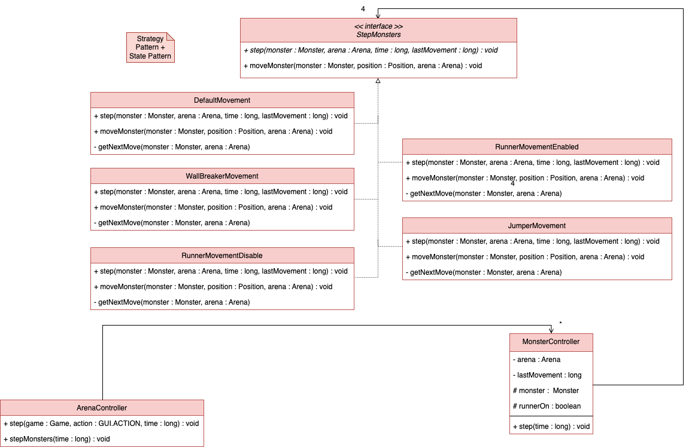

O código para as classes que utilizam este padrão encontra-se nos seguintes links:
- MonsterController: https://github.com/FEUP-LDTS-2023/project-l10gr08/blob/main/src/main/java/badIceCream/controller/game/MonsterController.java
- StepMonsters: https://github.com/FEUP-LDTS-2023/project-l10gr08/blob/main/src/main/java/badIceCream/controller/game/StepMonsters.java
- DefaultMovement: https://github.com/FEUP-LDTS-2023/project-l10gr08/blob/main/src/main/java/badIceCream/controller/game/monsters/DefaultMovement.java
- RunnerMovementEnabled: https://github.com/FEUP-LDTS-2023/project-l10gr08/blob/main/src/main/java/badIceCream/controller/game/monsters/RunnerMovementEnabled.java
- RunnerMovementDisabled: https://github.com/FEUP-LDTS-2023/project-l10gr08/blob/main/src/main/java/badIceCream/controller/game/monsters/RunnerMovementDisabled.java
- JumperMovement: https://github.com/FEUP-LDTS-2023/project-l10gr08/blob/main/src/main/java/badIceCream/controller/game/monsters/JumperMovement.java
- WallBreakerMovement: https://github.com/FEUP-LDTS-2023/project-l10gr08/blob/main/src/main/java/badIceCream/controller/game/monsters/WallBreakerMovement.java
- ArenaController: https://github.com/FEUP-LDTS-2023/project-l10gr08/blob/main/src/main/java/badIceCream/controller/game/ArenaController.java

### Consequências
Desta forma, quando se pretende executar _step_ de qualquer monstro, faz-se via _MonsterController_ e este encarrega-se de executar o respetivo movimento de cada monstro.
Para além disso, o Monster Controller altera o estado (tipo de movimento) do Runner Monster, passado de modo perseguição para modo aleatório, e vice-versa.

## _Game Loop Pattern_
### Contexto do Problema
Por se tratar de um jogo, existe um padrão de desenho evidente. O jogo funciona como um loop que vai iterando e fazendo alterações ao seu estado.

### Padrão
Este padrão consiste num loop onde é controlado o tempo de cada iteração, permitindo avançar mais rapidamente ou lentamente no jogo. O método "step" utilizado por várias classes, bem como o método "stepMonsters".

### Implementação
A implementação deste padrão é representada através do seguinte modelo UML:

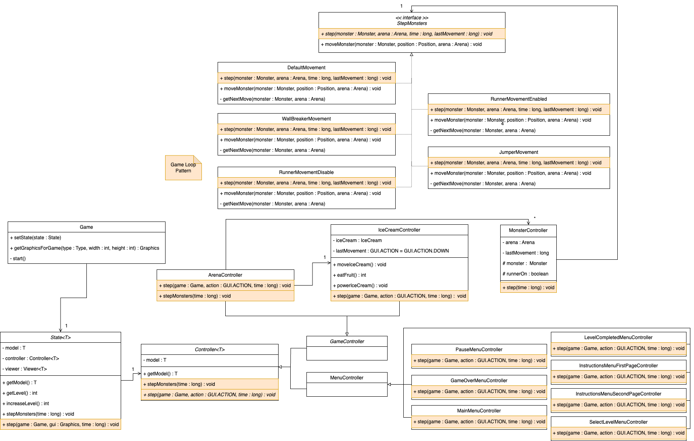

O código que reflete este padrão encontra-se nos seguintes links:
- Game: https://github.com/FEUP-LDTS-2023/project-l10gr08/blob/main/src/main/java/badIceCream/Game.java
- State: https://github.com/FEUP-LDTS-2023/project-l10gr08/blob/main/src/main/java/badIceCream/states/State.java
- Controller: https://github.com/FEUP-LDTS-2023/project-l10gr08/blob/main/src/main/java/badIceCream/controller/Controller.java
- GameController: https://github.com/FEUP-LDTS-2023/project-l10gr08/blob/main/src/main/java/badIceCream/controller/game/GameController.java
- MenuController: https://github.com/FEUP-LDTS-2023/project-l10gr08/blob/main/src/main/java/badIceCream/controller/menu/MenuController.java
- PauseMenuController: https://github.com/FEUP-LDTS-2023/project-l10gr08/blob/main/src/main/java/badIceCream/controller/menu/PauseMenuController.java
- MainMenuController: https://github.com/FEUP-LDTS-2023/project-l10gr08/blob/main/src/main/java/badIceCream/controller/menu/MainMenuController.java
- GameOverMenuController: https://github.com/FEUP-LDTS-2023/project-l10gr08/blob/main/src/main/java/badIceCream/controller/menu/GameOverMenuController.java
- InstructionsMenuFisrtPageController: https://github.com/FEUP-LDTS-2023/project-l10gr08/blob/main/src/main/java/badIceCream/controller/menu/InstructionsMenuFirstPageController.java
- InstructionsMenuSecondPageController: https://github.com/FEUP-LDTS-2023/project-l10gr08/blob/main/src/main/java/badIceCream/controller/menu/InstructionsMenuSecondPageController.java
- LevelCompletedMenuController: https://github.com/FEUP-LDTS-2023/project-l10gr08/blob/main/src/main/java/badIceCream/controller/menu/LevelCompletedMenuController.java
- SelectLevelMenuController: https://github.com/FEUP-LDTS-2023/project-l10gr08/blob/main/src/main/java/badIceCream/controller/menu/SelectLevelMenuController.java
- ArenaController: https://github.com/FEUP-LDTS-2023/project-l10gr08/blob/main/src/main/java/badIceCream/controller/game/ArenaController.java
- IceCreamController: https://github.com/FEUP-LDTS-2023/project-l10gr08/blob/main/src/main/java/badIceCream/controller/game/IceCreamController.java
- MonsterController: https://github.com/FEUP-LDTS-2023/project-l10gr08/blob/main/src/main/java/badIceCream/controller/game/MonsterController.java
- StepMonsters: https://github.com/FEUP-LDTS-2023/project-l10gr08/blob/main/src/main/java/badIceCream/controller/game/StepMonsters.java
- DefaultMovement: https://github.com/FEUP-LDTS-2023/project-l10gr08/blob/main/src/main/java/badIceCream/controller/game/monsters/DefaultMovement.java
- RunnerMovementEnabled: https://github.com/FEUP-LDTS-2023/project-l10gr08/blob/main/src/main/java/badIceCream/controller/game/monsters/RunnerMovementEnabled.java
- RunnerMovementDisabled: https://github.com/FEUP-LDTS-2023/project-l10gr08/blob/main/src/main/java/badIceCream/controller/game/monsters/RunnerMovementDisabled.java
- JumperMovement: https://github.com/FEUP-LDTS-2023/project-l10gr08/blob/main/src/main/java/badIceCream/controller/game/monsters/JumperMovement.java
- WallBreakerMovement: https://github.com/FEUP-LDTS-2023/project-l10gr08/blob/main/src/main/java/badIceCream/controller/game/monsters/WallBreakerMovement.java

### Consequências
Desta forma, consegue-se controlar a fluidez e a progressão do jogo ao longo do tempo.
   
## _Code Smells_
**TO BE DONE**  

## Testes
### _Coverage Report_

### _Mutation Testing Report_
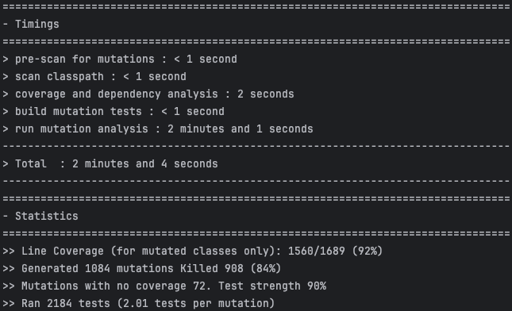

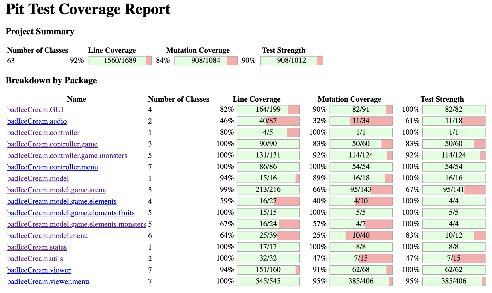

## Self-evaluation
Nelson Neto 33.3%  
Paulo Fidalgo 33.3%  
Simão Neri 33.3%
